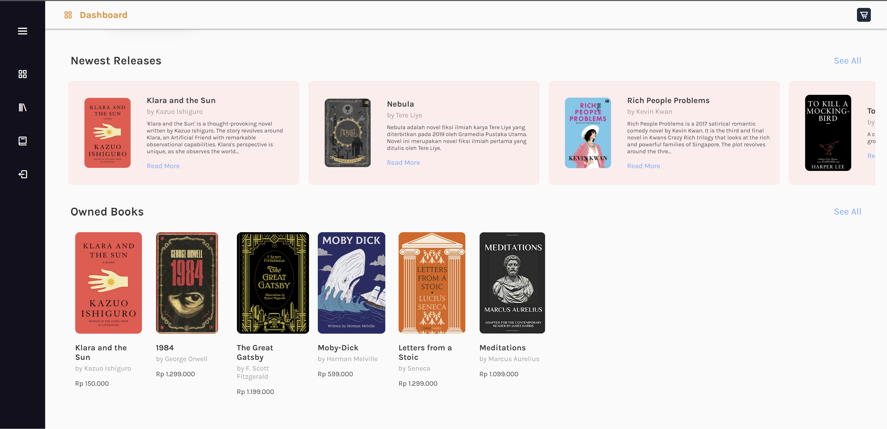
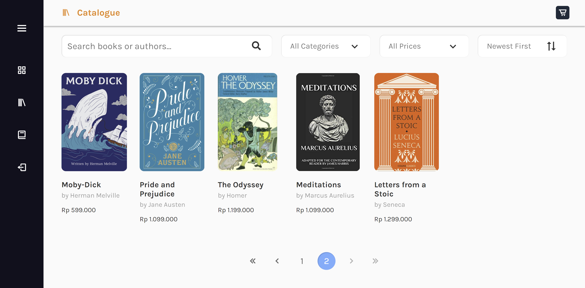
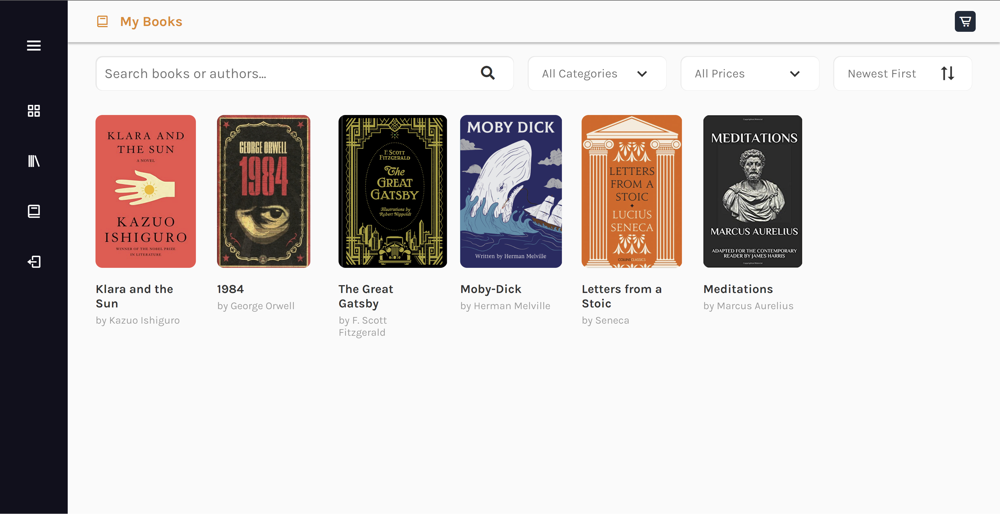
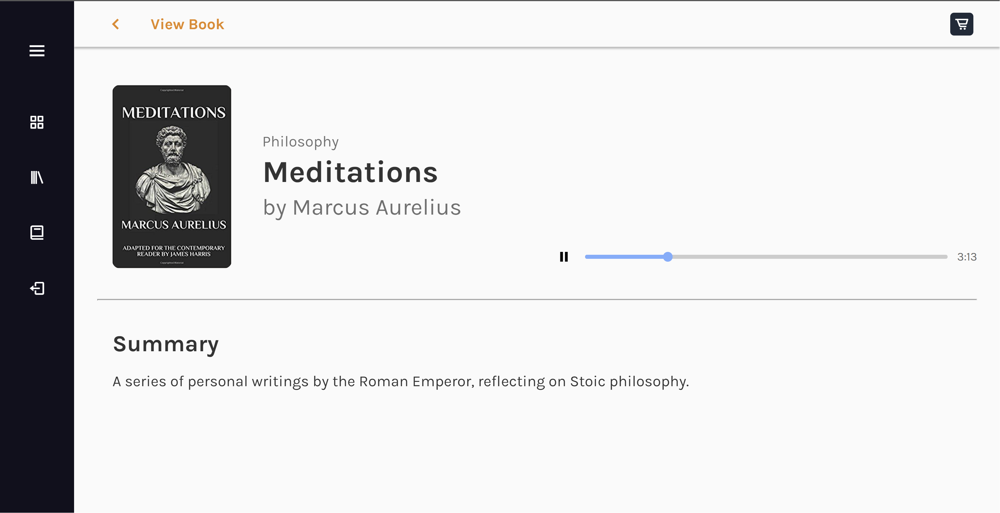
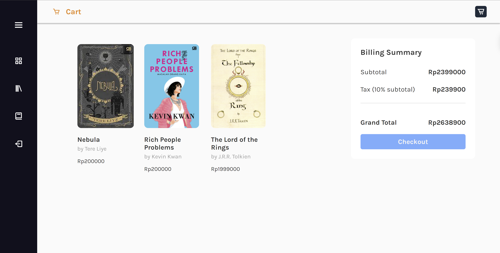
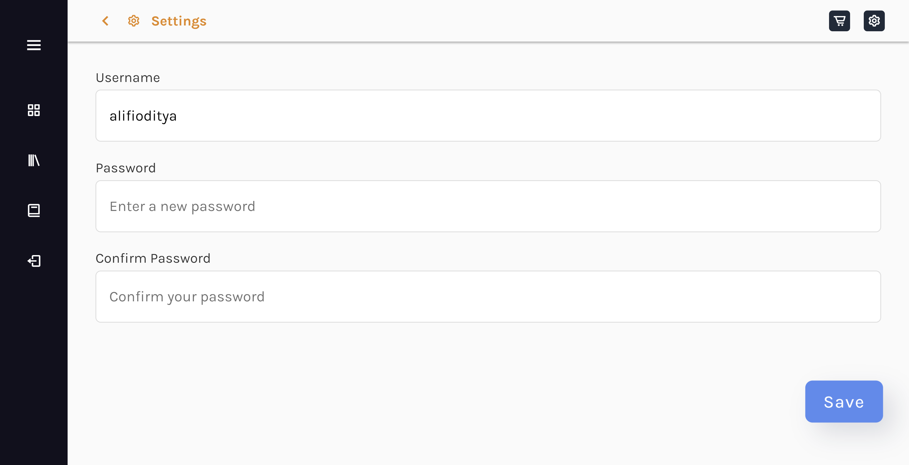
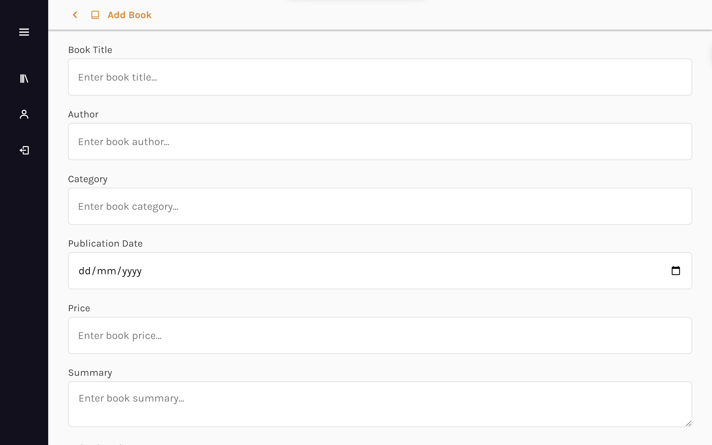
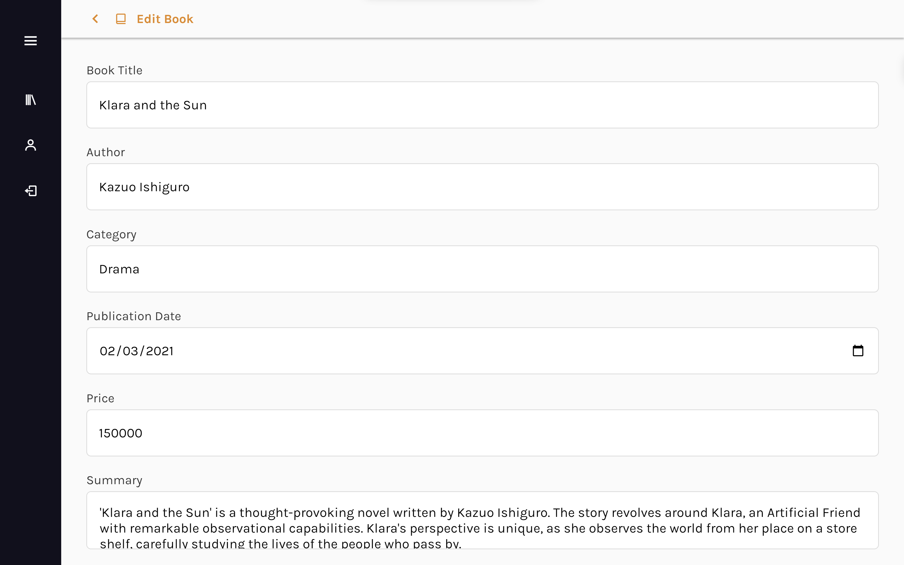
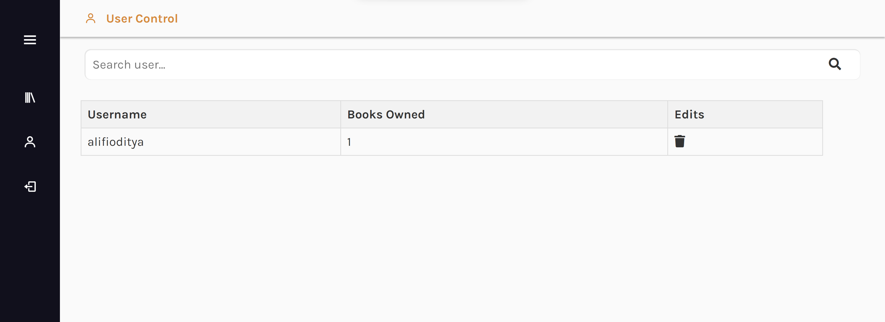

# Kinokuniya: Digital Audiobook Store

> Made as a Web Development course project by Bandung Institute of Technology Informatics Engineering Major, 2023.

Welcome to Kinokuniya's Digital Audiobook Store, where the world of literature comes to life through the power of sound. Dive into a captivating realm of storytelling as we bring you an extensive collection of digital audiobooks that will transport you to different worlds, ignite your imagination, and provide a rich auditory experience like no other.

Explore our vast library of audiobooks spanning various genres, from gripping thrillers to heartwarming romance, from mind-bending science fiction to inspiring self-help titles. Whether you're a seasoned audiobook enthusiast or new to the world of spoken-word literature, Kinokuniya's Digital Audiobook Store has something for everyone.

With our easy-to-use platform, you can browse, discover, and purchase your favorite audiobooks with just a few clicks. Our audiobooks are narrated by talented voices that bring characters to life and immerse you in the narrative, making it a perfect companion for your daily commute, a lazy afternoon, or any moment when you want to lose yourself in a great story.

# Requirements
- [HTML5](https://www.w3schools.com/html/)
- [CSS3](https://www.w3schools.com/css/)
- [JavaScript](https://www.w3schools.com/js/)
- [PHP](https://www.php.net/)
- [MySQL](https://www.mysql.com/)
- [Docker](https://www.docker.com/)

# Installation
1. Clone this repository
```bash
    $ git clone https://gitlab.informatika.org/if3110-2023-01-06/tugas-besar-1.git
```
2. Change directory to the cloned repository
```bash
    $ cd tugas-besar-1
```
3. Create a `.env` file
```bash
    $ cp .env.example .env
```
4. Open the `.env` file and complete the following lines
```bash
    MYSQL_ROOT_PASSWORD=
    MYSQL_USER=
    MYSQL_PASSWORD=
```
5. Make sure the database `scheme.sql` is in `/mysql` directory. If not, copy the `scheme.sql` file to the `/mysql` directory

# How to Run
1. Make sure you are in the cloned repository
```bash
    $ cd tugas-besar-1
```
2. Run the docker-compose
```bash
    $ docker-compose up
```
3. Open the website on your browser
```bash
    http://localhost:8080/public/user/login
```
4. To stop the docker-compose, press `Ctrl + C` on your terminal and run the following command
```bash
    $ docker-compose down
```

# Usage
## Login and Register
- Login with your account or register a new account
- You can login as an admin with the following credentials:
    - Username: admin
    - Password: admin123

## Home Page
- You can see the latest books on the home page
- You can click on the book card to see the book details

## Catalogue
- You can see all the books on the catalogue page
- You can filter the books by genre
- You can click on the book card to see the book details

## My Books
- You can see all the books you own on the my books page
- You can click on the book card to see the book details

## Book Details
- You can see the book details on the book details page
- You can add the book to your cart

## Cart
- You can see all the books in your cart on the cart page
- You can remove the book from your cart
- You can checkout your cart

## Admin Panel
- You can see all the books on the catalogue control page
- You can add a new book
- You can edit a book
- You can delete a book
- You can see all the users on the user control page
- You can edit a user
- You can delete a user

# Page Screenshots
## Login and Register Page


## Home Page
### Desktop View



### Tablet View


## Catalogue and My Books Page



## Book Details Page



## Cart Page


## Settings Page


## Admin Panel
### Catalogue Control Page

### Add and Edit Book Page


### User Control Page


# Task Distribution

## UI/UX Design
| Feature                  | NIM      | Name                 |
| ------------------------ | -------- | -------------------- |
| Login                    | 13521142 | Enrique Alifio Ditya |
| Register                 | 13521142 | Enrique Alifio Ditya |
| Home Page                | 13521142 | Enrique Alifio Ditya |
| Catalogue                | 13521142 | Enrique Alifio Ditya |
| Book Details Page        | 13521142 | Enrique Alifio Ditya |
| Cart                     | 13521142 | Enrique Alifio Ditya |
| Settings                 | 13521142 | Enrique Alifio Ditya |
| Catalogue Control Page   | 13521142 | Enrique Alifio Ditya |
| User Control Page        | 13521142 | Enrique Alifio Ditya |
| Add Book Page            | 13521142 | Enrique Alifio Ditya |
| Edit Book Page           | 13521142 | Enrique Alifio Ditya |

## Setup
| Requirements             | NIM      | Name                 |
| ------------------------ | -------- | -------------------- |
| Database                 | 13521142 | Enrique Alifio Ditya |
| Server                   | 13521142 | Enrique Alifio Ditya |
| Docker                   | 13521142 | Enrique Alifio Ditya |
| Configuration            | 13521142 | Enrique Alifio Ditya |

## Client Side
### Components
| Components               | NIM      | Name                 |
| ------------------------ | -------- | -------------------- |
| Sidebar                  | 13521142 | Enrique Alifio Ditya |
| Top Navbar               | 13521142 | Enrique Alifio Ditya |
| Search Bar               | 13521142 | Enrique Alifio Ditya |
| Dropdown                 | 13521142 | Enrique Alifio Ditya |
| Book Card                | 13521142 | Enrique Alifio Ditya |
| Pagination               | 13521142 | Enrique Alifio Ditya |
| Containers               | 13521142 | Enrique Alifio Ditya |

### Pages
| Pages                    | NIM      | Name                 |
| ------------------------ | -------- | -------------------- |
| Login                    | 13521142 | Enrique Alifio Ditya |
| Register                 | 13521142 | Enrique Alifio Ditya |
| Home Page                | 13521142 | Enrique Alifio Ditya |
| Catalogue                | 13521142 | Enrique Alifio Ditya |
| My Books Page            | 13521142 | Enrique Alifio Ditya |
| Book Details Page        | 13521142 | Enrique Alifio Ditya |
| Cart                     | 13521142 | Enrique Alifio Ditya |
| Settings                 | 13521142 | Enrique Alifio Ditya |
| Catalogue Control Page   | 13521142 | Enrique Alifio Ditya |
| Add Book Page            | 13521142 | Enrique Alifio Ditya |
| Edit Book Page           | 13521142 | Enrique Alifio Ditya |
| User Control Page        | 13521073 | Ezra M C M H         |

## Server Side
### Features
| Features                 | NIM      | Name                 |
| ------------------------ | -------- | -------------------- |
| Login                    | 13521142 | Enrique Alifio Ditya |
| Register                 | 13521142 | Enrique Alifio Ditya |
| Home Page                | 13521142 | Enrique Alifio Ditya |
| Catalogue                | 13521142 | Enrique Alifio Ditya |
| My Books Page            | 13521142 | Enrique Alifio Ditya |
| Book Details Page        | 13521142 | Enrique Alifio Ditya |
| Cart                     | 13521142 | Enrique Alifio Ditya |
| Settings                 | 13521142 | Enrique Alifio Ditya |
| Catalogue Control Page   | 13521142 | Enrique Alifio Ditya |
| Add Book Page            | 13521142 | Enrique Alifio Ditya |
| Edit Book Page           | 13521142 | Enrique Alifio Ditya |
| User Control Page        | 13521073 | Ezra M C M H         |

### Models
| Models                   | NIM      | Name                 |
| ------------------------ | -------- | -------------------- |
| User                     | 13521142 | Enrique Alifio Ditya |
| Book                     | 13521142 | Enrique Alifio Ditya |

### Controllers
| Controllers              | NIM      | Name                 |
| ------------------------ | -------- | -------------------- |
| User                     | 13521142 | Enrique Alifio Ditya |
| Book                     | 13521142 | Enrique Alifio Ditya |

### Routes
| Routes                   | NIM      | Name                 |
| ------------------------ | -------- | -------------------- |
| User                     | 13521142 | Enrique Alifio Ditya |
| Book                     | 13521142 | Enrique Alifio Ditya |
| Admin                    | 13521142 | Enrique Alifio Ditya |

### Middlewares
| Middlewares              | NIM      | Name                 |
| ------------------------ | -------- | -------------------- |
| Authentication           | 13521142 | Enrique Alifio Ditya |
| Authorization            | 13521142 | Enrique Alifio Ditya |

### Database
| Database                 | NIM      | Name                 |
| ------------------------ | -------- | -------------------- |
| User                     | 13521142 | Enrique Alifio Ditya |
| Book                     | 13521142 | Enrique Alifio Ditya |
| Cart                     | 13521142 | Enrique Alifio Ditya |

### Error Handler
| Error Handler            | NIM      | Name                 |
| ------------------------ | -------- | -------------------- |
| All                      | 13521142 | Enrique Alifio Ditya |

### Helpers
| Helpers                  | NIM      | Name                 |
| ------------------------ | -------- | -------------------- |
| All                      | 13521142 | Enrique Alifio Ditya |

## Testing and Debugging
| Features                 | NIM      | Name                 |
| ------------------------ | -------- | -------------------- |
| All                      | 13521142 | Enrique Alifio Ditya |

# Author
- [Enrique Alifio Ditya - 13521142](https://github.com/AlifioDitya)

# Made With


